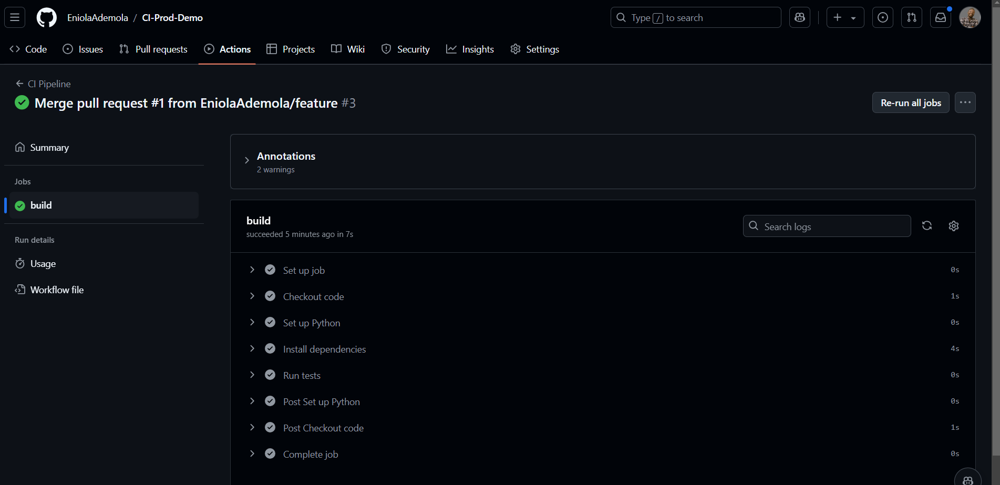
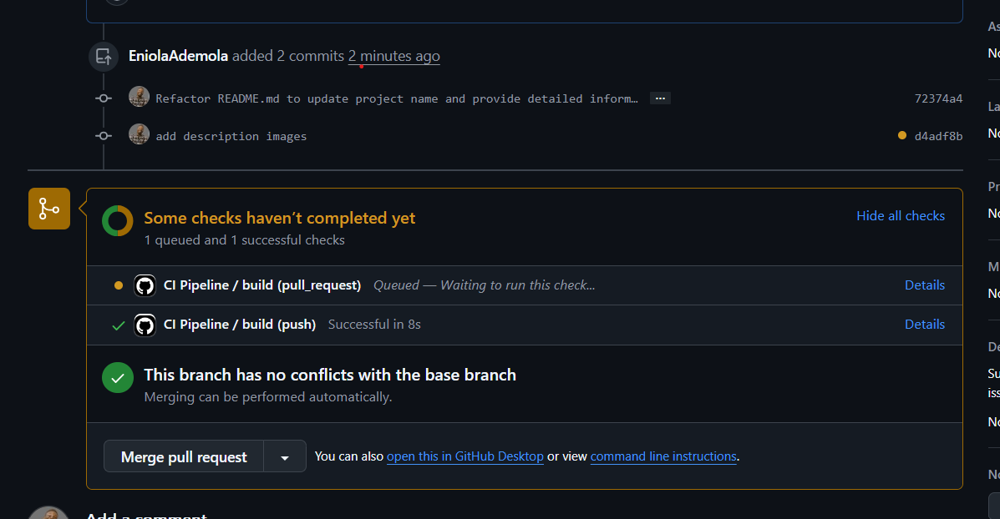
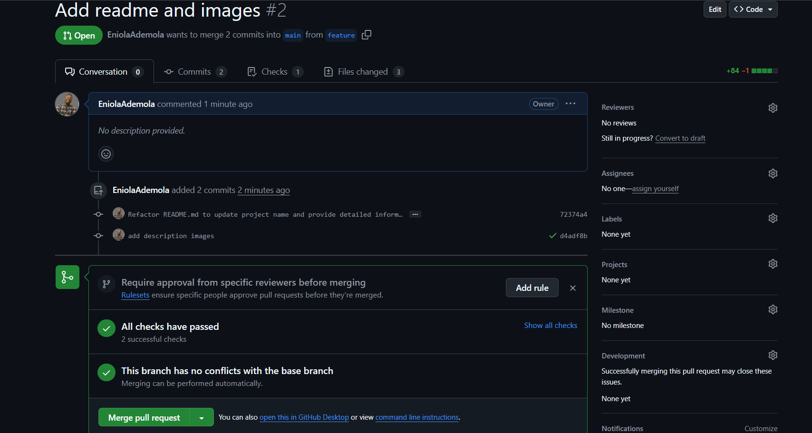
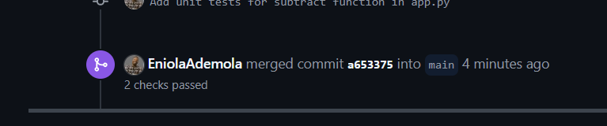

# CI-ProdDemo

Welcome to **CI-ProdDemo**, a simple Python project demonstrating Continuous Integration (CI) using GitHub Actions.

This project includes a basic function for subtracting two numbers and unit tests to validate the function’s behavior. The CI pipeline is configured using a GitHub Actions workflow to automate code testing on every push and pull request to the `main` and `feature` branches.

## Project Structure

- **`app.py`**: Contains the `subtract` function and allows user input for testing subtraction manually.
- **`test_app.py`**: Contains unit tests for the `subtract` function.
- **`.github/workflows/ci.yml`**: GitHub Actions CI configuration to automate the testing process.
- **`assets/githubActions.png`**: Image showing the GitHub Actions CI pipeline running successfully.
- **`assets/test_success.png`**: Image showing the successful test results.
- **`assets/checkInProgress.png`**: Image showing the CI pipeline in progress.
- **`assets/pullRequestChecks.png`**: Image showing the checks for a pull request.

## Features

- **Subtraction Function**: A simple function to subtract two numbers.
- **Unit Testing**: Uses Python's `unittest` framework to test the `subtract` function with different inputs.
- **Continuous Integration**: Automated testing with GitHub Actions to ensure code quality.

## How to Use

### Running Locally

1. Clone the repository:

    ```bash
    git clone https://github.com/EniolaAdemola/CI-Prod-Demo
    cd CI-Prod-Demo
    ```

2. Run the application:

    ```bash
    python app.py
    ```

   You’ll be prompted to enter two numbers for subtraction.

### Running Tests

1. To run the tests locally:

    ```bash
    python -m unittest discover -s tests
    ```

   This will run the unit tests defined in `test_app.py`.

## Continuous Integration (CI)

This project uses GitHub Actions for CI. Every push or pull request to the `main` or `feature` branches triggers the following steps:

1. **Code Checkout**: Retrieves the latest code from the repository.
2. **Set up Python**: Installs Python 3.8 on the CI environment.
3. **Install Dependencies**: Installs required dependencies using `pip`.
4. **Run Tests**: Executes the unit tests to validate the `subtract` function.

The CI pipeline is defined in `.github/workflows/ci.yml`.

### GitHub Actions CI in Action

Here’s an image showing the CI pipeline running via GitHub Actions:



### CI Pipeline in Progress

Here’s an image showing the CI pipeline in progress:



### Pull Request Checks

Here’s an image showing the checks running for a pull request:



### Successful Test Execution

Here’s an image showing the successful test results:



## Project Dependencies

- Python 3.8 or higher
- `unittest`: Python's built-in unit testing framework

## GitHub Repository

You can view the source code and CI configuration on GitHub: [CI-Prod-Demo](https://github.com/EniolaAdemola/CI-Prod-Demo)

---

Thank you for checking out this project!
